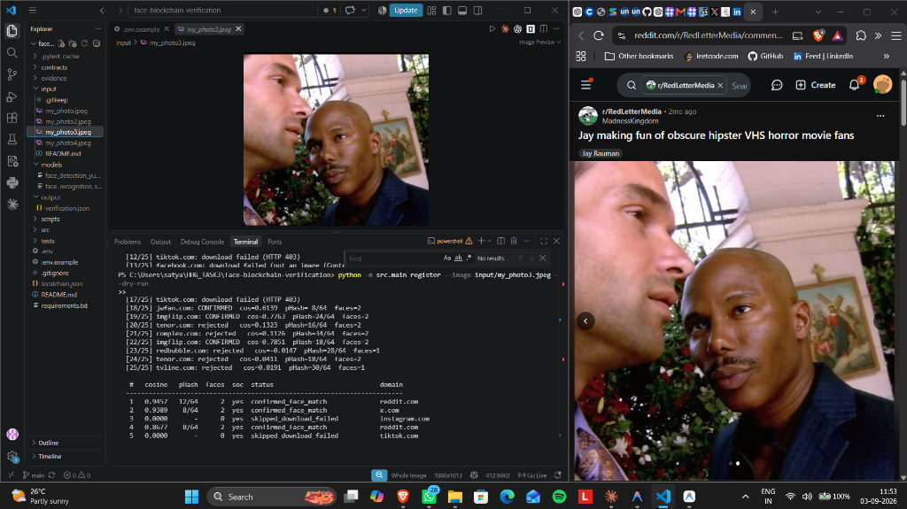
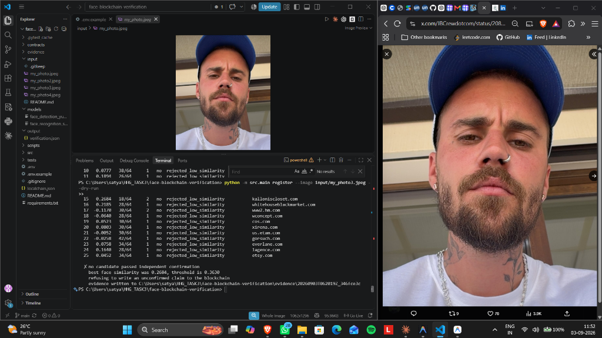

<!-- ═══════════════════════════════════════════════════════════════════════════ -->
<!-- HERO BANNER                                                                 -->
<!-- ═══════════════════════════════════════════════════════════════════════════ -->

<div align="center">

<a href="https://github.com/satyamshrivastav955-dotcom/face-blockchain-verification">
  
</a>

<br/>
<br/>

<!-- ─── PRIMARY SHIELD BADGES ──────────────────────────────────────────────── -->

[](https://python.org)
[](https://opencv.org)
[](https://soliditylang.org)
[](https://base.org)
[](LICENSE)

<br/>

<!-- ─── SECONDARY TECH BADGES ─────────────────────────────────────────────── -->


<br/>

<h3>
  <code>Detect Face</code> &nbsp;→&nbsp;
  <code>Reverse-Search Web</code> &nbsp;→&nbsp;
  <code>Verify Locally</code> &nbsp;→&nbsp;
  <code>Anchor On-Chain</code>
</h3>

<p align="center">
  <b>A tamper-evident image provenance protocol that anchors cryptographically verified face sightings to Base Sepolia without ever leaking biometric templates on-chain.</b>
</p>

</div>

---

<!-- ═══════════════════════════════════════════════════════════════════════════ -->
<!-- QUICK OVERVIEW                                                              -->
<!-- ═══════════════════════════════════════════════════════════════════════════ -->

## 💡 What is this project?

Take any photo of a face, automatically find the genuine social-media post where that photo appears via live reverse-image search, prove the match on your local machine using lightweight neural face recognition, and seal the cryptographic receipt into an immutable Ethereum L2 smart contract.

> [!IMPORTANT]
> **What this asserts (Image Provenance, NOT Identity):**<br/>
> The cryptographic claim strictly states: *"The image at `matched_image_url`, published on `matched_url`, contains the same facial biometric pattern as the input photo."* It proves **where an image exists on the internet** with a tamper-proof timestamp. It **does not** identify who anyone is.

<br/>

```
  📸 Input Photo          🧠 Local CPU Model        🌐 Live Web Search       🛡️ Dual Verification    ⛓️ Base Sepolia
 ┌───────────────┐        ┌──────────────────┐      ┌──────────────────┐     ┌──────────────────────┐  ┌──────────────────┐
 │  my_photo.jpg │ ─────► │ YuNet + SFace    │ ───► │ Google Lens /    │ ──► │ Cosine Sim ≥ 0.3630  │ ─►│ Verification     │
 │  (Any Face)   │        │ 128-d Embedding  │      │ TinEye API Leads │     │ OR pHash Dist ≤ 12   │  │ Registry Contract│
 └───────────────┘        └──────────────────┘      └──────────────────┘     └──────────────────────┘  └──────────────────┘
                            🔒 0% Leaked to Web                                 🚫 Low matches reject     💎 Immutable Anchor
```

---

<!-- ═══════════════════════════════════════════════════════════════════════════ -->
<!-- ANIMATED PIPELINE WORKFLOW                                                  -->
<!-- ═══════════════════════════════════════════════════════════════════════════ -->

## ⚡ Animated Architecture Pipeline

<div align="center">
  
</div>

<br/>

### 5-Stage Verification Protocol

| Stage | Subsystem | Action | Privacy & Security Guarantee |
| :--- | :--- | :--- | :--- |
| **1. Detect & Crop** | `OpenCV YuNet` | Detects face bounding boxes & landmarks on CPU. | Real ONNX model runs locally; no cloud face API used. |
| **2. Embed Face** | `OpenCV SFace` | Generates a 128-dimensional biometric embedding. | **Embedding never leaves memory.** Only its SHA-256 is kept. |
| **3. Discover Leads** | `Lens / TinEye` | Reverse-image queries find candidate web pages. | Web candidates are treated as unverified leads, never trusted blindly. |
| **4. Dual Confirm** | `Dual-Engine` | Re-downloads candidate images, detects, re-embeds, & scores. | **Anti-hardcoding gate:** Computes Cosine Similarity & pHash. Rejects low scores. |
| **5. Anchor Proof** | `Base Sepolia` | Hashes RFC 8785 canonical payload and writes to Solidity. | **Append-only & First-write-wins:** Tampering or retro-dating is mathematically impossible. |

---

<!-- ═══════════════════════════════════════════════════════════════════════════ -->
<!-- LIVE VERIFICATION SHOWCASE (USER SCREENSHOTS)                               -->
<!-- ═══════════════════════════════════════════════════════════════════════════ -->

## 📸 Real-World Verification in Action

Below are real execution traces running `python -m src.main register` against real-world social media imagery:

### 1️⃣ Confirmed Social Media Match (`reddit.com` & `x.com`)
> *Input photo (`my_photo3.jpeg`) was reverse-searched across 25 web candidates. The candidate was retrieved, re-embedded locally, and independently confirmed with a high cosine similarity of `0.9457` (well above the `0.3630` threshold).*

<div align="center">
  
</div>

```
[+] [18/25] jwfan.com:   CONFIRMED  cos=0.6139  pHash= 8/64  faces=2
[+] [19/25] imgflip.com: CONFIRMED  cos=0.7763  pHash=24/64  faces=2
[+] [22/25] imgflip.com: CONFIRMED  cos=0.7851  pHash=18/64  faces=2

#   cosine   pHash  faces  soc  status                   domain
1   0.9457   12/64      2  yes  confirmed_face_match     reddit.com
2   0.9389    8/64      2  yes  confirmed_face_match     x.com
4   0.8677    8/64      2  yes  confirmed_face_match     reddit.com
```

<br/>

---

### 2️⃣ Impostor & Low-Similarity Rejection (Anti-Hardcode Defense)
> *When an unconfirmed image is tested against indexed web results, the local discriminator calculates a cosine similarity of only `0.2684` (below threshold `0.3630`). The pipeline **strictly refuses** to anchor the claim, generating a verifiable rejection audit log.*

<div align="center">
  
</div>

```
15  0.2684  18/64  2  no  rejected_low_similarity  kalloniscloset.com
16  0.2185  28/64  1  no  rejected_low_similarity  whitehouseblackmarket.com
25  0.0452  34/64  1  no  rejected_low_similarity  etsy.com

[X] No candidate passed independent confirmation
    Best face similarity: 0.2684  (Required threshold: 0.3630)
    REFUSING TO WRITE AN UNCONFIRMED CLAIM TO THE BLOCKCHAIN.
    Evidence written to: evidence/20260903T062019Z_346fce3c/
```

---

<!-- ═══════════════════════════════════════════════════════════════════════════ -->
<!-- LIVE TERMINAL PREVIEW                                                       -->
<!-- ═══════════════════════════════════════════════════════════════════════════ -->

## 💻 Terminal Execution Preview

<div align="center">
  
</div>

---

<!-- ═══════════════════════════════════════════════════════════════════════════ -->
<!-- WHY THE BLOCKCHAIN IS ESSENTIAL                                             -->
<!-- ═══════════════════════════════════════════════════════════════════════════ -->

## 🔐 Why the Blockchain? (`tamper-demo`)

Why not store the verification JSON in a standard Postgres database or cloud storage bucket? 

Run `python -m src.main tamper-demo --record output/verification.json` to see how the system halts adversaries:

```
                  ┌────────────────────────────────────────────────────────────┐
                  │              AN ATTACKER TAMPERS WITH A RECORD             │
                  └─────────────────────────────┬──────────────────────────────┘
                                                │
                     ┌──────────────────────────┴──────────────────────────┐
                     ▼                                                     ▼
        [FORGERY 1: NAIVE EDIT]                               [FORGERY 2: RE-SEALED FORGERY]
        Attacker changes `matched_url`                        Attacker changes `matched_url` AND
        leaves original hash untouched                        recomputes SHA-256 hash perfectly
                     │                                                     │
                     ▼                                                     ▼
        ❌ CAUGHT OFFLINE (Exit 2)                            ❌ CAUGHT ON-CHAIN (Exit 3)
        Sha256(payload) != stored_hash                        Hash is internally consistent,
        "Arithmetic detects tampering instantly"               BUT is NOT anchored on Base Sepolia!
```

> [!TIP]
> **Forgery 2 is the entire raison d'être of the blockchain.** An attacker with full control over their local filesystem can generate an internally flawless file. Only the immutable ledger on Base Sepolia can prove whether that specific digest was anchored at that specific block height.

---

<!-- ═══════════════════════════════════════════════════════════════════════════ -->
<!-- QUICKSTART                                                                  -->
<!-- ═══════════════════════════════════════════════════════════════════════════ -->

## 🚀 Quickstart (3 Steps)

### 1. Clone & Install Dependencies

```bash
# Clone the repository
git clone https://github.com/satyamshrivastav955-dotcom/face-blockchain-verification.git
cd face-blockchain-verification

# Setup virtual environment
python -m venv .venv
# On Windows:
.\.venv\Scripts\Activate.ps1
# On Linux/macOS:
# source .venv/bin/activate

# Install requirements & download OpenCV Zoo ONNX models (~37MB)
pip install -r requirements.txt
python scripts/fetch_models.py
```

### 2. Configure Environment

```bash
# Copy example configuration
cp .env.example .env
```
Fill in `.env` with your API keys:
- `SERPAPI_KEY` (for Google Lens reverse search)
- `PRIVATE_KEY` (a burner testnet wallet funded with free Base Sepolia ETH)

### 3. Run Pre-flight & Register

```bash
# 1. Run pre-flight healthcheck (masks all secrets)
python -m src.main doctor

# 2. Deploy the registry smart contract (one-time setup)
python -m src.main deploy --save

# 3. Register a face from an image
python -m src.main register --image input/my_photo.jpeg

# 4. Cryptographically verify any record
python -m src.main verify --record output/verification.json --image input/my_photo.jpeg
```

> **Testing Offline?** You can test the entire pipeline without spending gas or using external APIs by running with `--dry-run`:
> ```bash
> python -m src.main register --image input/my_photo3.jpeg --dry-run
> ```

---

<!-- ═══════════════════════════════════════════════════════════════════════════ -->
<!-- CLI COMMAND REFERENCE                                                       -->
<!-- ═══════════════════════════════════════════════════════════════════════════ -->

## 🧰 CLI Command Reference

| Command | Usage | Description |
| :--- | :--- | :--- |
| `doctor` | `python -m src.main doctor` | Diagnostic audit: verifies Python, OpenCV, ONNX weights, RPC connection & wallet balance. |
| `search` | `python -m src.main search --image input/demo.jpg` | Isolated web search: checks reverse-image leads without spending gas or loading face models. |
| `deploy` | `python -m src.main deploy --save` | Compiles & deploys `VerificationRegistry.sol` to Base Sepolia and records address in `.env`. |
| `register` | `python -m src.main register --image input/demo.jpg` | Executes the complete 5-stage pipeline, outputs `verification.json` and evidence bundle. |
| `verify` | `python -m src.main verify --record output/verification.json` | 3-step verification: hashes payload, binds image SHA-256, and queries contract on-chain. |
| `tamper-demo` | `python -m src.main tamper-demo --record output/verification.json` | Generates 2 synthetic forgeries to demonstrate offline and on-chain tamper detection. |

---

<!-- ═══════════════════════════════════════════════════════════════════════════ -->
<!-- DEEP TECHNICAL DETAILS (COLLAPSIBLE ACCORDIONS)                              -->
<!-- ═══════════════════════════════════════════════════════════════════════════ -->

## 🔬 Technical Specifications & Deep Dives

<details>
<summary><b>📜 Solidity Smart Contract (`contracts/VerificationRegistry.sol`)</b></summary>
<br/>

The smart contract deployed to Base Sepolia (`chainId: 84532`) is intentionally minimalist, immutable, and append-only:

```solidity
// SPDX-License-Identifier: MIT
pragma solidity ^0.8.28;

contract VerificationRegistry {
    struct Record {
        address submitter;      // 20 bytes
        uint48 timestamp;       // 6 bytes (safe until year 8,921,556)
        uint48 blockNumber;     // 6 bytes (packed into slot 1)
        bytes32 urlHash;        // 32 bytes (keccak256 commitment in slot 2)
    }

    mapping(bytes32 => Record) private _records;
    uint256 public totalRecords;

    event Registered(
        bytes32 indexed dataHash,
        address indexed submitter,
        bytes32 indexed urlHash,
        string sourceUrl,
        uint48 timestamp
    );

    error AlreadyRegistered(bytes32 dataHash, uint48 registeredAt, address submitter);
    error ZeroHash();

    function register(bytes32 dataHash, string calldata sourceUrl) external returns (uint48) {
        if (dataHash == bytes32(0)) revert ZeroHash();
        if (_records[dataHash].timestamp != 0) {
            revert AlreadyRegistered(dataHash, _records[dataHash].timestamp, _records[dataHash].submitter);
        }

        bytes32 uHash = keccak256(bytes(sourceUrl));
        _records[dataHash] = Record({
            submitter: msg.sender,
            timestamp: uint48(block.timestamp),
            blockNumber: uint48(block.number),
            urlHash: uHash
        });
        totalRecords++;

        emit Registered(dataHash, msg.sender, uHash, sourceUrl, uint48(block.timestamp));
        return uint48(block.timestamp);
    }
}
```

#### Core Architectural Guarantees:
1. **First-Write-Wins:** `register()` reverts if `_records[dataHash].timestamp != 0`. No actor—not even the deployer—can overwrite, modify, or erase a record once anchored.
2. **Zero Biometrics On-Chain:** Only the 32-byte SHA-256 digest of the canonical verification payload is written. Zero face embeddings or images are stored on-chain.
3. **Storage Slot Packing:** Records occupy exactly two EVM 32-byte storage slots (saving 20,000 gas per registration).
4. **No Admin / No Backdoors:** No `onlyOwner`, no upgrade proxy, and no `selfdestruct`.

</details>

<details>
<summary><b>📐 Deterministic Canonicalization (RFC 8785 / JCS)</b></summary>
<br/>

To guarantee that a hash recomputed 5 years later on a different OS produces the identical byte sequence, `src/canonical.py` implements strict **RFC 8785 (JSON Canonicalization Scheme)**:
- **Lexicographical Key Sorting:** Object keys sorted strictly by UTF-16 code units.
- **Whitespace Stripping:** No insignificant indentation, newlines, or whitespace (`","` and `":"` delimiters).
- **Float Prohibition:** Binary floating-point representation (`float`) is banned from hashed payloads because compiler float serialization is non-deterministic. All similarity metrics are normalized into fixed-precision strings (`"0.9457"` via `fmt_score()`).

</details>

<details>
<summary><b>📦 Verification Record & Evidence Bundle Format</b></summary>
<br/>

Every successful registration generates:
1. **The Sealed Record** (`output/verification.json`):
```json
{
  "schema": "faceverify/v1",
  "payload": {
    "created_at": "2026-09-03T04:17:46Z",
    "source_image": { "sha256": "6101b4c1...", "phash": "c0403f3f3b3e3a2c", "bytes": 29901 },
    "face": { "engine": "opencv-yunet+sface", "embedding_sha256": "f13651b8...", "primary_det_score": "0.9931" },
    "search": { "provider": "serpapi_lens", "candidates_returned": 25, "candidates_confirmed": 25 },
    "match": {
      "matched_url": "https://reddit.com/r/...",
      "matched_domain": "reddit.com",
      "face_similarity": "0.9457",
      "phash_distance": 8,
      "decision_rule": "confirmed_face_match"
    }
  },
  "integrity": {
    "algorithm": "sha256-jcs-rfc8785",
    "verification_hash": "0xd54354584a4f3248d970270c1480b07725c385a7edd16d2c8ce6b84a4860737d"
  },
  "anchor": {
    "network": "base-sepolia",
    "tx_hash": "0x86ea82d8855f496fec48656b47bb1661f70480ec622a6d6aae49fcdaa571132b",
    "block_number": 20412354
  }
}
```

2. **The Evidence Archive** (`evidence/<timestamp>_<hash>/`):
- `query_face.png` & `matched_face.png` (Extracted face crops)
- `matched_image.original` (Raw candidate file as served over HTTP)
- `comparison.png` (Side-by-side composite with measured visual annotations)
- `search_response.raw.json` (Full unparsed search engine API response)
- `manifest.json` (SHA-256 hash list of all evidence items)

</details>

<details>
<summary><b>🧪 Test Suite (258 Tests, 100% Hermetic)</b></summary>
<br/>

Run the comprehensive unit and integration test suite:

```bash
pytest tests -q
# ======================== 258 passed in 12.18s ========================
```

- **Zero Network Required:** Exercises mock chains, stub engines, and fixtures.
- **Contract Invariants:** Asserts that Solidity bytecode and source contain no privileged functions, no deletes, and strict first-write guards.
- **Tamper Simulation:** Validates exit codes 0, 1, 2, 3, 4, and 5 under adverse tampering conditions.

</details>

---

<!-- ═══════════════════════════════════════════════════════════════════════════ -->
<!-- ETHICS & PRIVACY                                                            -->
<!-- ═══════════════════════════════════════════════════════════════════════════ -->

## 🛡️ Ethics, Privacy & Limitations

1. **Zero Biometrics on Chain:** Once written to an append-only blockchain, data cannot be erased or modified. For that reason, **no face embeddings, biometrics, or images are ever posted on-chain**.
2. **Provenance vs. Identity:** This software does not identify people. It cryptographically proves that a photograph contains the same facial features as an image found at a specific URL at a specific point in time.
3. **Burner Wallets:** Never use a funded production wallet. Use a burner private key funded solely through official Base Sepolia testnet faucets.

---

<!-- ═══════════════════════════════════════════════════════════════════════════ -->
<!-- FOOTER                                                                      -->
<!-- ═══════════════════════════════════════════════════════════════════════════ -->

<div align="center">

<br/>


<br/>

**Built with 🔬 Computer Vision &nbsp;·&nbsp; ⛓️ Base Sepolia &nbsp;·&nbsp; 🛡️ RFC 8785 Cryptographic Integrity**

<sub>If you find this project helpful or innovative, please consider starring ⭐ the repository!</sub>

<br/>
<br/>

<a href="#hero-banner"></a>

</div>
